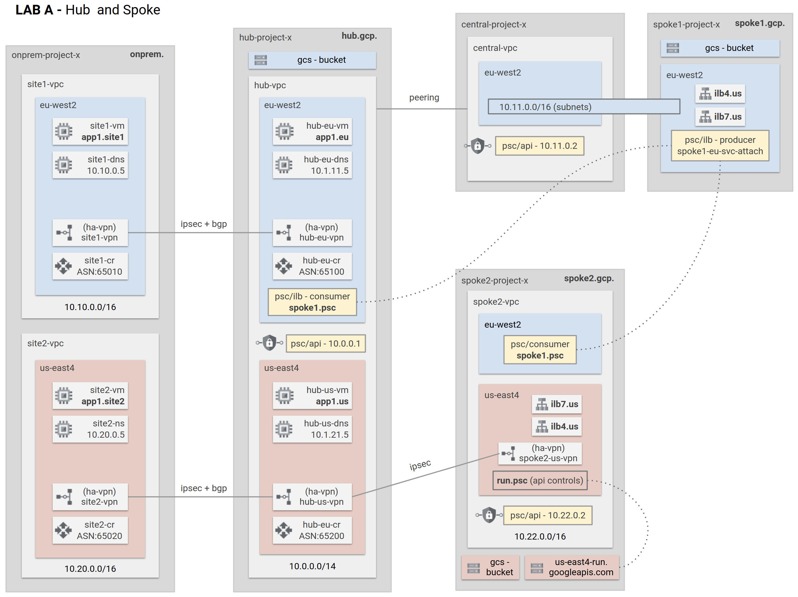

# LAB A: Hub and Spoke


This code deploys the following:
- A hub and spoke topology with two spoke VPCs
- Hybrid connectivity to simulated on-premises sites via HA-VPN
- Network Connectivity Center (NCC) is used to connect the on-premises sites together via the Hub VPC
- Other networking features such as Cloud DNS, PSC for Google APIs, L4 ILB, L7 ILB etc.



## 1) Pre-requisites

See [setup.md](docs/setup.md) to ensure your environment meets the requirement to deploy the lab.

## 2) Export your project IDs to terraform variables
```
export TF_VAR_organizational_id=
export TF_VAR_project_id_onprem=[YOUR_ONPREM_PROJECT_ID]
export TF_VAR_project_id_hub=[YOUR_HUB_PROJECT_ID]
export TF_VAR_project_id_host=[YOUR_HOST_PROJECT_ID]
export TF_VAR_project_id_spoke1=[YOUR_SPOKE1_PROJECT_ID]
export TF_VAR_project_id_spoke2=[YOUR_SPOKE2_PROJECT_ID]
```

## 2) Authenticate with gcloud
```
gcloud auth login
gcloud auth application-default login
```

## 3) Navigate to lab directory
This example shows lab `a-standard`
```
cd cloudnet/1-blueprints/a-standard/
```

## 4) Deploy the lab
```
terraform init
terraform plan
terraform apply
```

## 5) Test Lab

See [test.md](docs/test.md) to test the networking features in the lab

## 5) Destroy Lab

```
terraform destroy
```

Due to a race condition, you might encounter the following error message related to removal of service project attachment to the shared VPC of a hos project
```
Error: local-exec provisioner error

   with null_resource.remove_service_project_spoke1,
   on 05-host.tf line 136, in resource "null_resource" "remove_service_project_spoke1":
  136:   provisioner "local-exec" {

 Error running command 'gcloud compute shared-vpc associated-projects remove spoke1-project-x
 \
 --host-project=central-project-x
 ': exit status 1. Output: ERROR: (gcloud.compute.shared-vpc.associated-projects.remove)
 Could not disable resource [spoke1-project-x] as an associated resource for project
 [central-project-x]:
  - Invalid resource usage: 'The resource 'projects/spoke1-project-x/regions/europe-west2/backendServices/a-spoke1-eu-ilb4' is still linked to shared VPC host 'projects/central-project-x'.'.

 Error encountered!!!
```

Run `terraform destroy` again to destroy the remaining resources.

## Requirements

No requirements.

### Inputs

| Name | Description | Type | Default | Required |
|------|-------------|------|---------|:--------:|
| bgp\_range | bgp interface ip cidr ranges. | `map(string)` | <pre>{<br>  "cidr1": "169.254.101.0/30",<br>  "cidr10": "169.254.110.0/30",<br>  "cidr2": "169.254.102.0/30",<br>  "cidr3": "169.254.103.0/30",<br>  "cidr4": "169.254.104.0/30",<br>  "cidr5": "169.254.105.0/30",<br>  "cidr6": "169.254.106.0/30",<br>  "cidr7": "169.254.107.0/30",<br>  "cidr8": "169.254.108.0/30",<br>  "cidr9": "169.254.109.0/30"<br>}</pre> | no |
| disk\_size | disk size | `string` | `"10"` | no |
| disk\_type | disk type | `string` | `"pd-ssd"` | no |
| gre\_range | gre interface ip cidr ranges. | `map(string)` | <pre>{<br>  "cidr1": "172.16.1.0/24",<br>  "cidr2": "172.16.2.0/24",<br>  "cidr3": "172.16.3.0/24",<br>  "cidr4": "172.16.4.0/24",<br>  "cidr5": "172.16.5.0/24",<br>  "cidr6": "172.16.6.0/24",<br>  "cidr7": "172.16.7.0/24",<br>  "cidr8": "172.16.8.0/24"<br>}</pre> | no |
| image\_debian | vm instance image | `string` | `"debian-cloud/debian-10"` | no |
| image\_panos | palo alto image from gcp marketplace | `string` | `"https://www.googleapis.com/compute/v1/projects/paloaltonetworksgcp-public/global/images/vmseries-bundle1-810"` | no |
| image\_ubuntu | vm instance image | `string` | `"ubuntu-os-cloud/ubuntu-1804-lts"` | no |
| image\_vyos | vyos image from gcp marketplace | `string` | `"https://www.googleapis.com/compute/v1/projects/sentrium-public/global/images/vyos-1-2-6-s1"` | no |
| machine\_type | vm instance size | `string` | `"e2-micro"` | no |
| organization\_id | organization id | `any` | n/a | yes |
| project\_id\_host | host project id | `any` | n/a | yes |
| project\_id\_hub | hub project id | `any` | n/a | yes |
| project\_id\_onprem | onprem project id (for onprem site1 and site2) | `any` | n/a | yes |
| project\_id\_spoke1 | spoke1 project id (service project id attached to the host project | `any` | n/a | yes |
| project\_id\_spoke2 | spoke2 project id (standalone project) | `any` | n/a | yes |

### Outputs

No output.
